# LS021B7DD02 64-Color Memory LCD Evaluation Kit

1. [Introduction](#introduction)
2. [Board Overview](#board_overview)
3. [Setting Up the Hardware](#setting_up_hardware)
4. [Prepare the Development Environment](#prepare_dev_env)
5. [Download the S1D13C00 Software from Epson](#epson_sw)
6. [Importing the Examples](#import_examples)

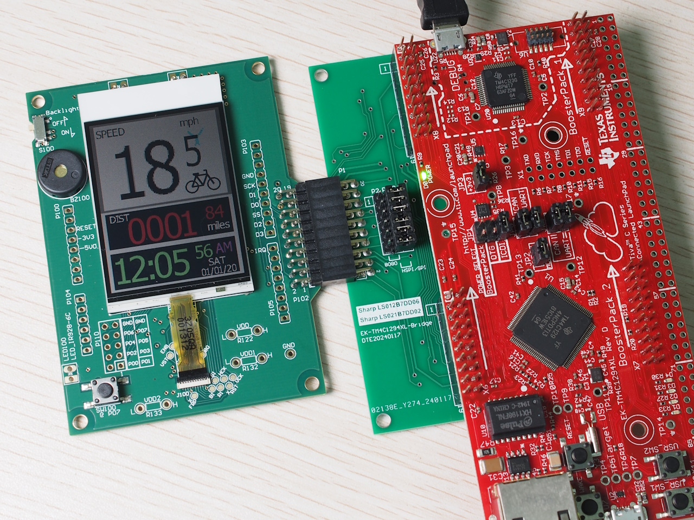


 ## Introduction <a name="introduction"></a>

The LS021B7DD02 64-Color Memory LCD Evaluation Kit is a evaluation platform mainly for two components:

1. LCD model LS021B7DD02 manufactured by Sharp with the following specifications
   * Reflective active-matrix with slightly transmissive panel of Color
   
   * 2.13" screen of 240x320 resolution
   
   * 6-bit parallel data signal communication
   
   * 1 pixel has a RGB each of 2-bit color depth (64 colors)
   
     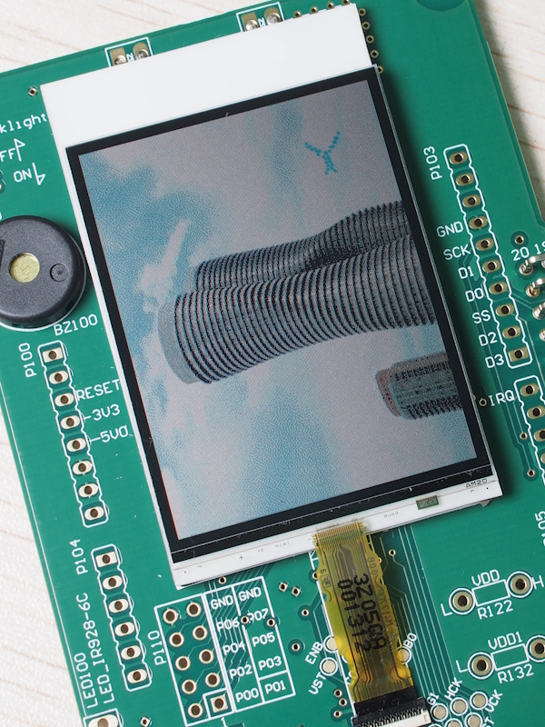
   
2. S1D13C00 Memory Display Controller manufactured by Epson
   * a graphics controller for memory displays with internal, programmable step-up and charge-pump voltage converter which are typically needed by memory displays
   
   * 96Kbyte internal RAM for display frame buffer
   
   * hardware-based graphics engine for image copying, scaling, rotation, and shearing effects
   
   * support flexible MCU interface of 8-bit 8080 mode, SPI, and QSPI
   
     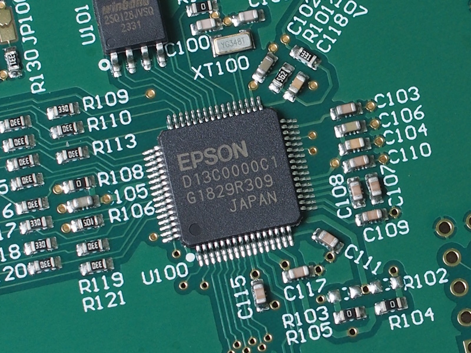

## Board Overview <a name="board_overview"></a>

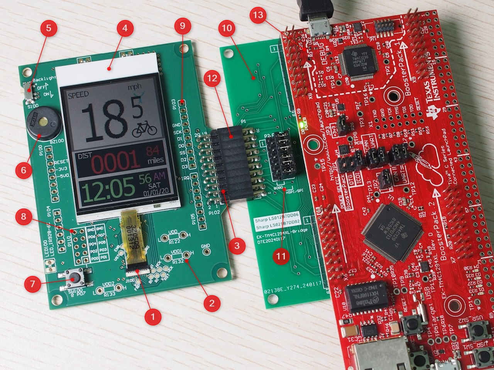

1. Molex connector 5035662102 to mate with LS021B7DD02
2. R132 (100R, 0.1%), R133 (100R, 0.1%), and R122(10R, 0.1%) with test points for VDD1 of LS021B7DD02, VDD2 of LS021B7DD02, and VDD of S1D13C00. Please read schematic in this repository.
3. P102 is an interface connector of S1D13C00 to an external microcontroller
4. Backlight module
5. On/OFF switch of the backlight module
6. Buzzer connecting to P10 and P11 of S1D13C00 
7. A tact switch connecting to P07 of S1D13C00 
8. 2.54mm header connecting to P01 - P06 of S1D13C00 
9. P103, P104, P100, and P105 are pin header compatible with Arduino Uno form factor
10. Bridge board (EK-TM4C1294XL-Bridge) to interface with Texas Instruments Tiva:tm: C Series TM4C1294 LaunchPad Evaluation Kit
11. Jumper array to set 8080/HSPI/SPI as the microcontroller interface
12. P1 on EK-TM4C1294XL-Bridge to mate with P102 on LS021B7DD02 board
13. Texas Instruments Tiva:tm: C Series TM4C1294 LaunchPad Evaluation Kit

## Setting Up the Hardware <a name="setting_up_hardware"></a>

Install the LCD


Mate the connectors

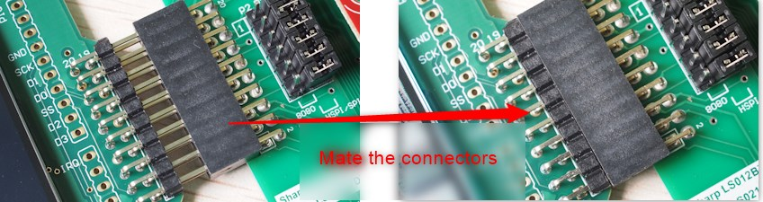

Make sure jumper positions set to HSPI/SPI interface

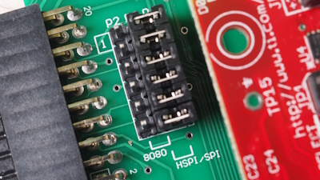

Connect USB cable

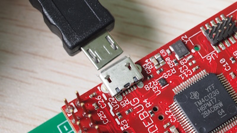


## Prepare the Development Environment <a name="prepare_dev_env"></a>

Download and install Code Composer Studio (CCS) from this web site:

https://www.ti.com/tool/CCSTUDIO

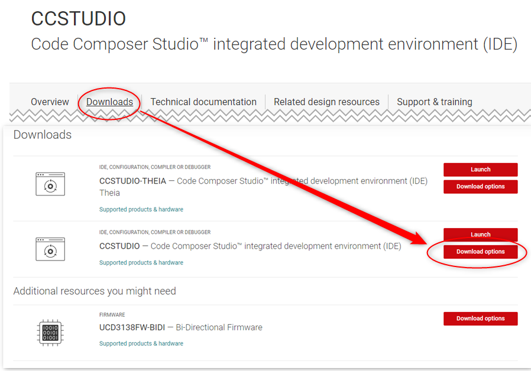

You need to create a myTI account ID with a valid email and password to download the software.

Various download options are supported: Windows/MacOS/Linux. In my case, I have selected the Windows single file (offline) installer:

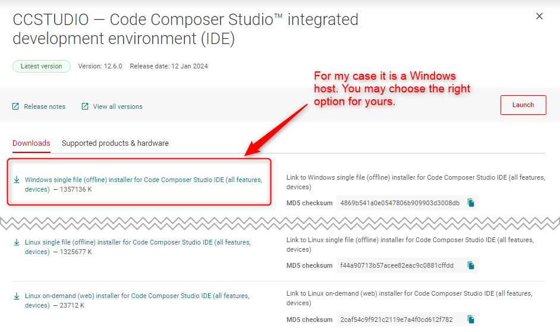

Double click to run ccs_setup_xxxx.exe:


Accept the default installation directory suggested for simplicity:

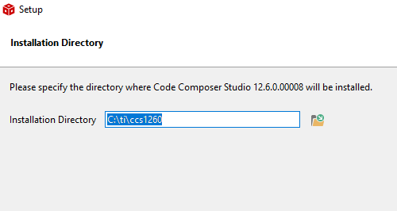

The Code Composer Studio supports all MCU and MPU models of Texas Instruments. We only need one of them. To save time and our hard disk resource, select Custom Installation option, followed by TM4C12x ARM Cortex-M4F core-based MCUs as the component to install.

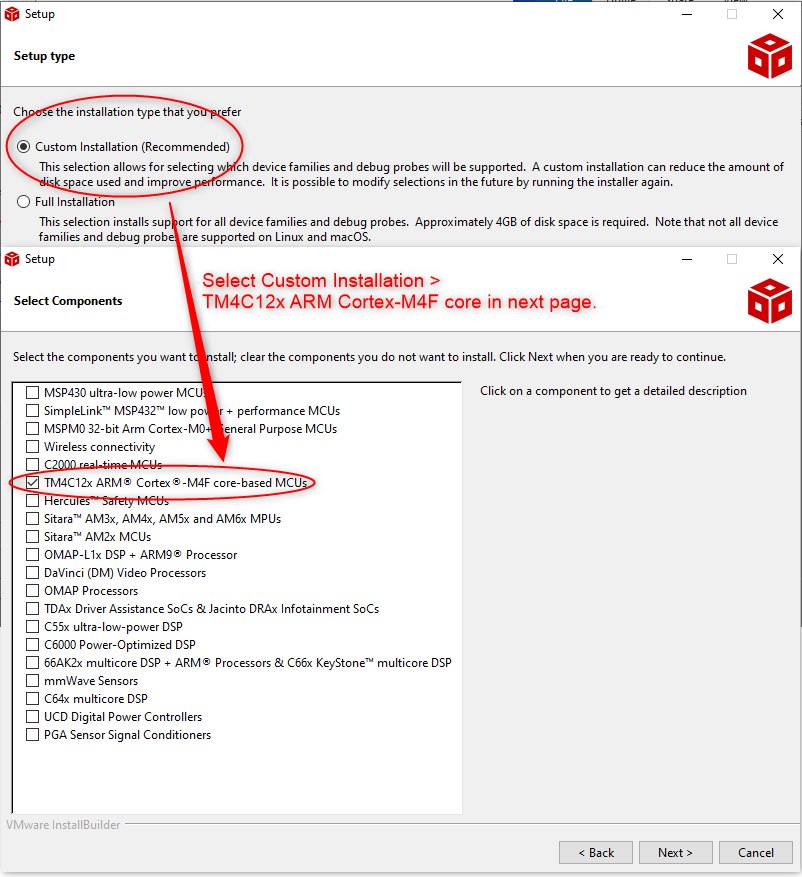

Click few more Next buttons to accept default installation options to continue. When you see Installation Completed message, click OK to reboot your machine.

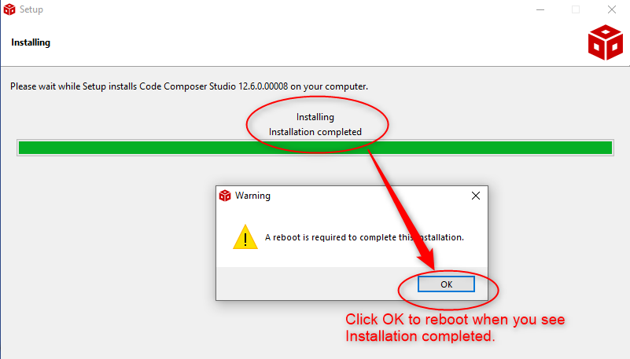

Next, download and install TivaWare which is a collection of royalty-free libraries to control the TM4C1294 MCU.

TivaWare is found at: http://www.ti.com/tool/SW-TM4C

Click **Download > Download options > SW-TM4C-2.2.0.295.exe**.

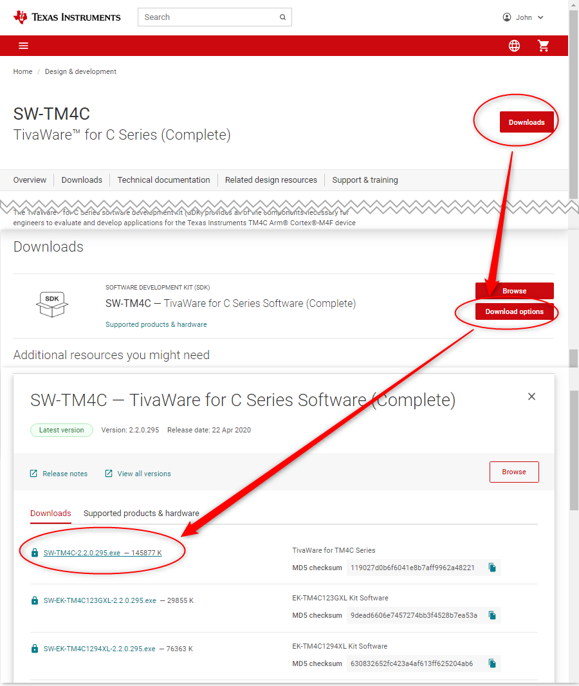

Accept the default installation directory for simplicity:

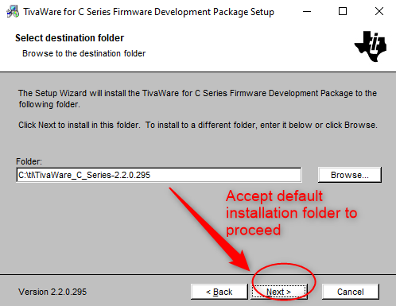

Launch CCS with a workspace project created at your own convenience. In my case, the default workspace is located at **C:\Users\JohnLeung\workspace_v12**. Your case will be different in the field of user name. 

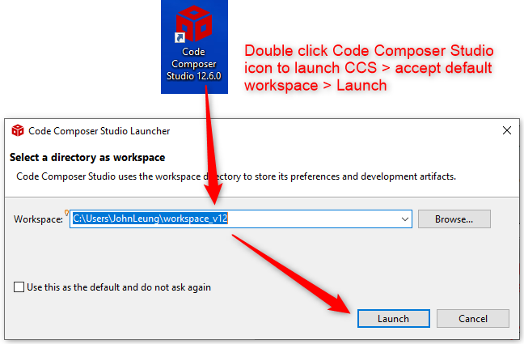


## Download the S1D13C00 Software from Epson <a name="epson_sw"></a>

Software package containing the driver source code and demo projects of the S1D13C00 Memory Display Controller is available from this web site:

https://vdc.epson.com/display-controllers/mdc/s1d13c00.

Scrolling down the page you will see a link to download an exe file [S1D13C00 Peripheral Circuit Sample Software Rev 3.0](https://vdc.epson.com/display-controllers/mdc/s1d13c00/s1d13c00-sample-software-for-ti-3).

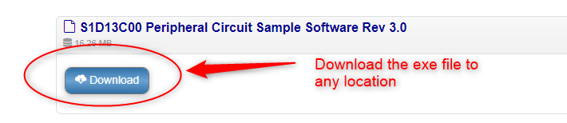

Double click the exe file to install the software package.

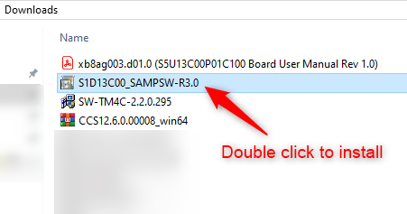

Accept the default installation directory C:/EPSON for simplicity (you may choose any location convenient to you).

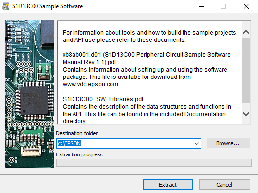

Now you have everything to develop an application for LS021B7DD0x + S1D13C00.

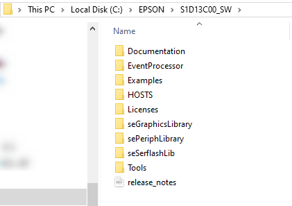

## Importing the Examples <a name="import_examples"></a>

Follow the procedures below to import and run the first project on LS021B7DD02 64-Color Memory LCD Evaluation Kit.

Step 1: Launch Code Composer Studio

Step 2: Import an example from the Epson folder you have just extracted in previous section. 

From **Project > Import CCS Projects**

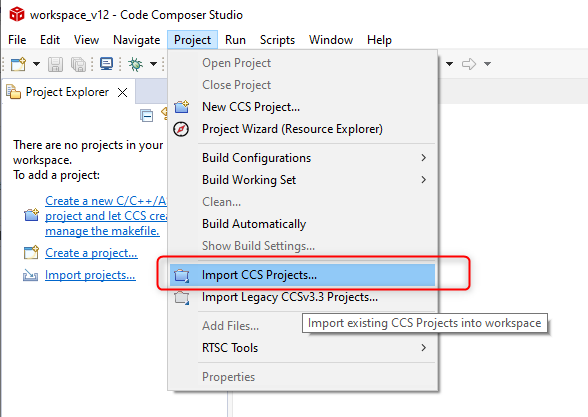

Step 3: Browse to the location of S1D13C00 example folder at **C:\EPSON\S1D13C00_SW\Examples**,  select the **demo2_LS021B7DD01** folder, click **Select Folder** button

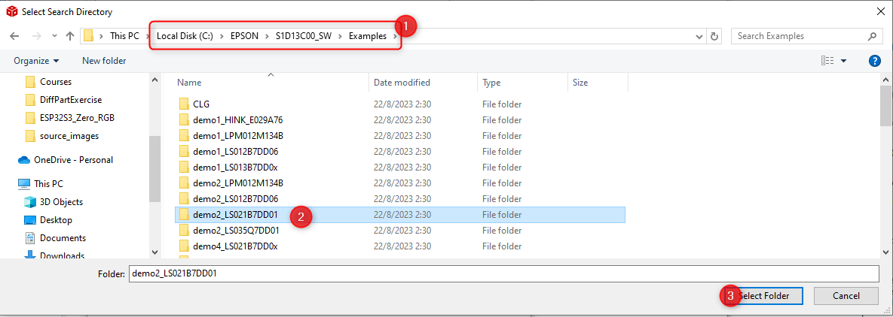

Step 4: You will see three options in the next screen. Select EK-TM4C1294XL as the host because it is what we are using. Click Finish.

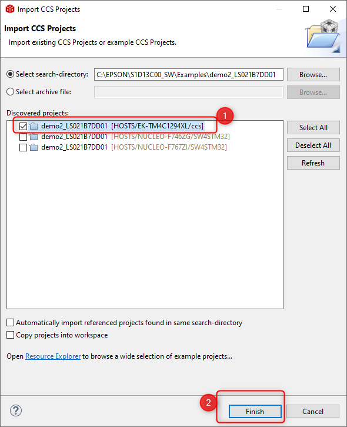

Step 5: You will see a new project under the **Project Explorer**. Right click on the project title and select **Properties**.

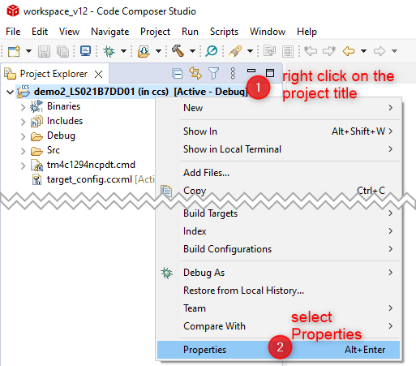

Step 6: Expand Resource tab, click **Linked Resources**. Create a new Path Variable by clicking the **New** button.

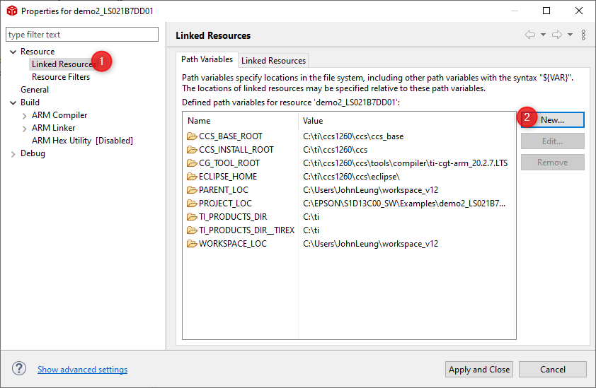

Step 7: Enter TIVAWARE_INSTALL_DIR to the Name textbox. Click **Folder...** button to add the path location of TivaWare library > **Select Folder**. 

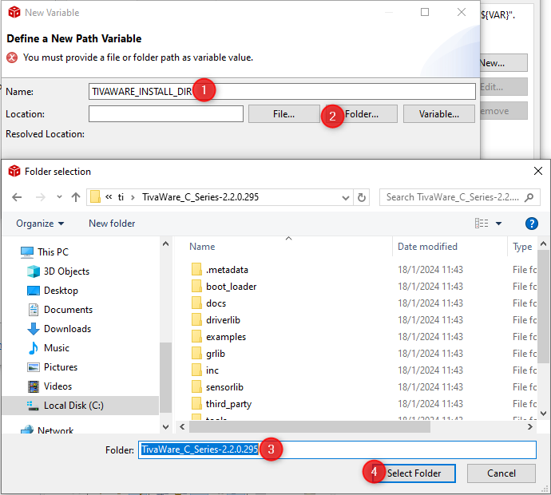

Step 8: You will see the New Variable dialog box look something like this. Click OK to exit. 

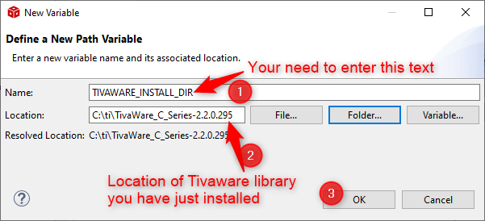

Step 9: Now there is a new Path Variable **TIVAWARE_INSTALL_DIR** that points to the path of Tivaware library. Click **Apply and Close**.

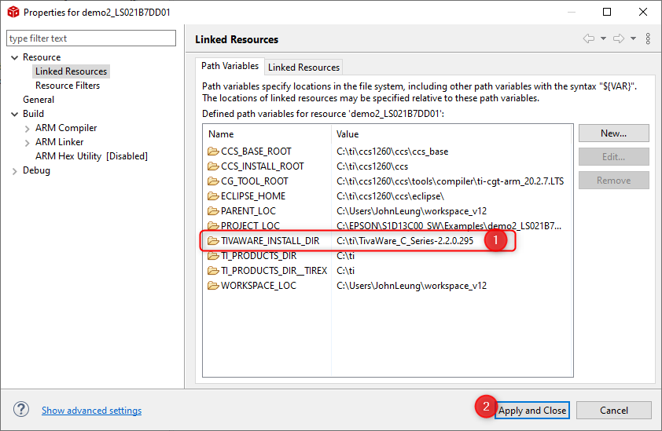

Step 10: Build the project to make sure there is no error.


Step 11: For demo2, we need to make a minor modification to the source code. Expand **Src > User**, open main.c and browse to the bottom. Make change to the source code as follows:

```C
     if (pic != prevpic)
     {
         seQSPI_SetMasterRxMMA( img01_RMADRH, 0xEB );
         seDMAC_MemCpy32 (picslib[pic], RAM_BASE, 240*80, seDMAC_CH2);
         DISPLAYUPDATE();
         seMDC_WaitUpdDone();
         seQSPI_ClearMasterRxMMA();
         prevpic = pic;

         printf ("Current image number is %d\n", pic );
        // This snippet doesn't work for some unknown reason(s)
        // Enable MMA mode
        // seQSPI_SetMasterRxMMA( img01_RMADRH, 0xEB );
        // FrameScrollUpdate (picslib[prevpic], picslib[pic], RAM_BASE, ...);
        // prevpic = pic;
        // seQSPI_ClearMasterRxMMA();
     }
```

The changes are summarized in the screen capture below:

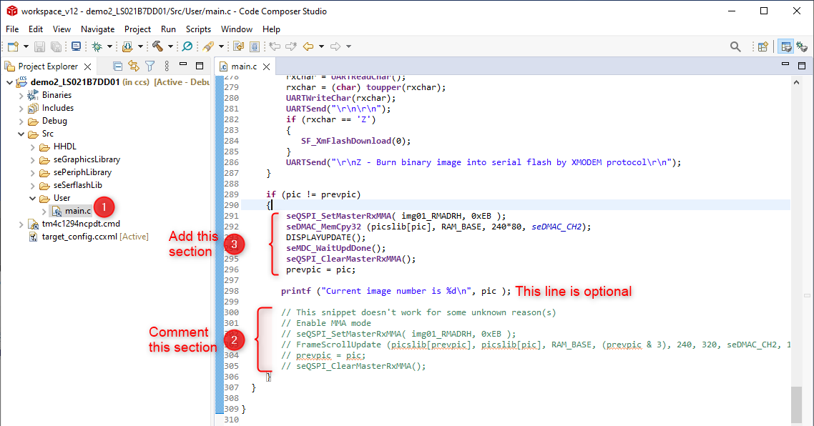

Step 12: Click Debug button from the menu bar then Run.

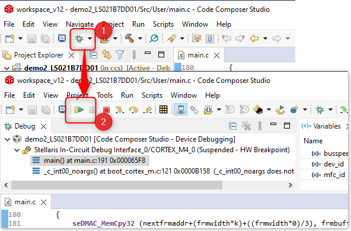

Step 13: You may browse the photo catalog from the Serial Flash by clicking on SW1 on the red board (TM4C1294-EK). Feel free to test the backlight quality.

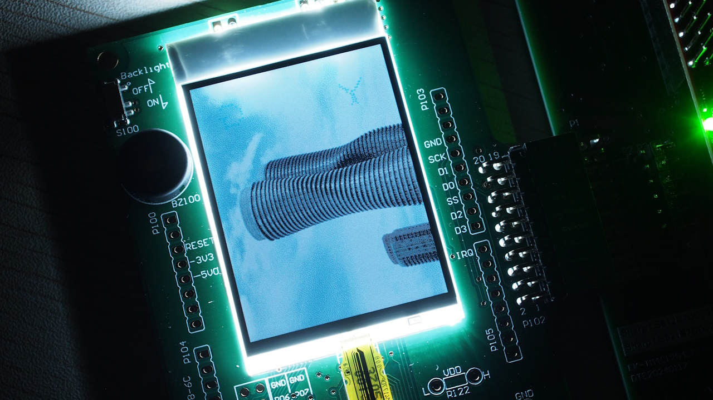

Step 14: Photos on the LCD are stored (ex-factory) in the 128Mbit (16MByte) Serial Flash W25Q128JVSIQTR close to Epson S1D13C00. Image sources are available from the demo2 folder under \source_images.

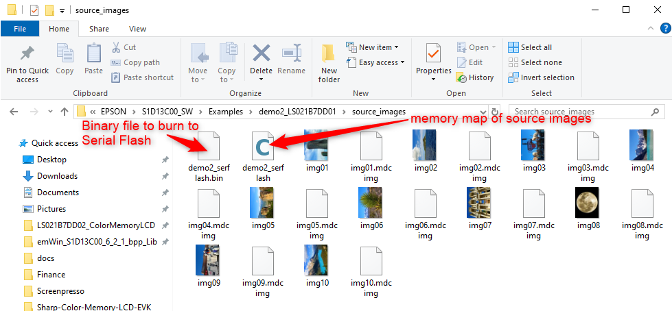

Epson has released [three tools](https://vdc.epson.com/display-controllers/s1d13c00-peripheral-circuit-sample-software-manual/viewdocument/611) to convert fonts and images to format compatible with S1D13C00.

Features of the tools are summarized below:

| Tool                            | Features                                                     |      |
| ------------------------------- | ------------------------------------------------------------ | ---- |
| Font Conversion MDCFontConv.exe | Generate font bitmaps header (.h) or binary files (.mdcfont) from system fonts in PC. |      |
| MDCImgConv.exe                  | Convert common image formats (BMP, PNG, JPG, ICO, TIF, GIF) to pixel formats supported by S1D13C00. The tool can generate header files (.h), binary files (.mdcimg) or HEX files (.hex). |      |
| MDCSerFlashImg.exe              | Create a binary image for downloading to the serial flash W25Q128JVSIQTR |      |

Step 15: Use Tera Term to update the Serial Flash with a new binary file. Launch Tera Term, select the new COM Port enumerated. Click OK.

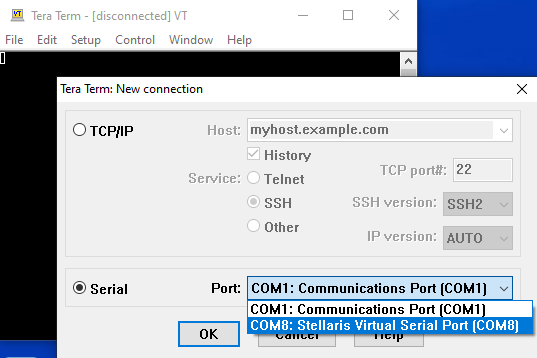

Step 16: From **Setup > Serial Port > set Speed to 115200 > New setting**.

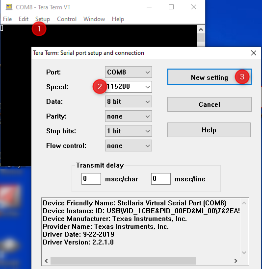

Step 17: By clicking the reset button from TM4C1294-EK board, you will see a short manual from Tera Term. Type <Z> from keyboard to erase the Serial Flash. 

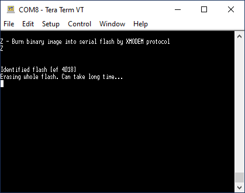

Step 18: After erase complete you will see a probe to send a binary file by XModem protocol. 

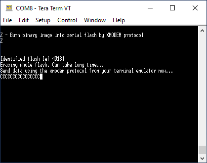

From **File > Transfer > XMODEM > Send**, browse to the binary file (C:\EPSON\S1D13C00_SW\Examples\demo2_LS021B7DD01\source_images\demo2_serflash.bin)  to download. 

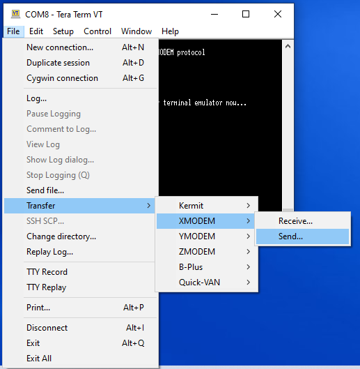

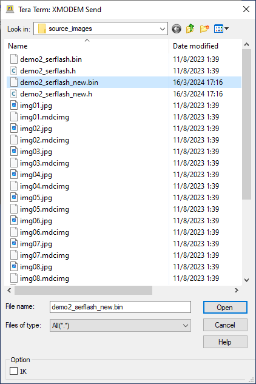

You will see the progress of Xmodem transfer. 

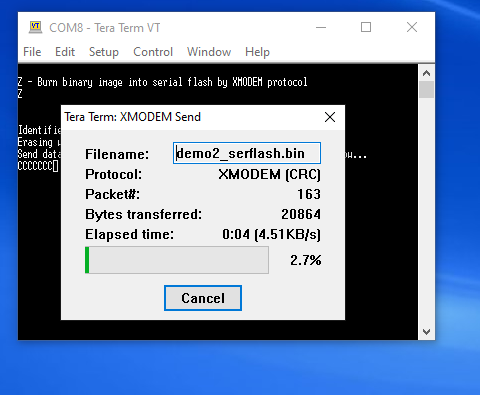

Wait until it finishes. It takes time.

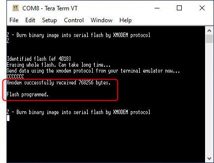

Finally, click reset on TM4C1294 LaunchPad. Scrolling different images by clicking SW1.

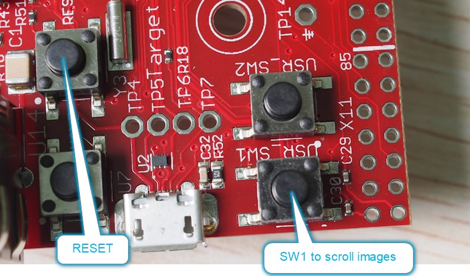

You will see different images on the LCD with demo2 by clicking SW1.

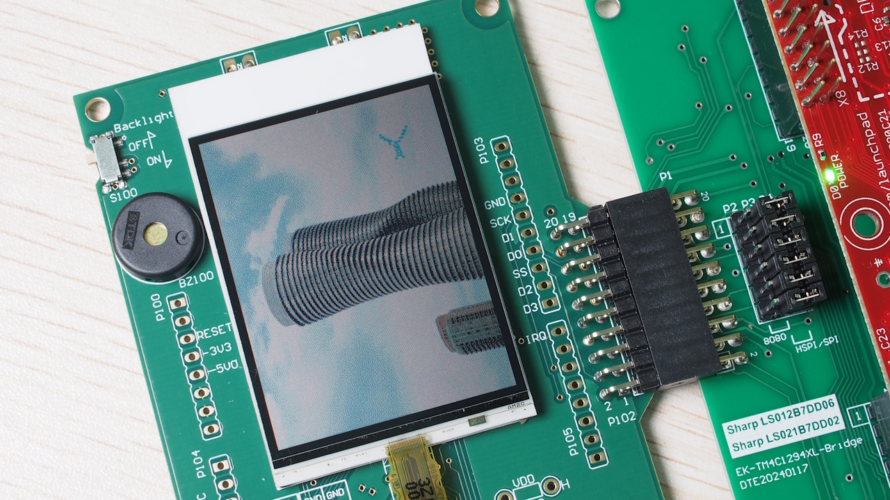

Step 19: Repeat the same procedures above to import more examples. Don't forget to set the Path Variable  of **TIVAWARE_INSTALL_DIR** as that in step 9 for other examples.

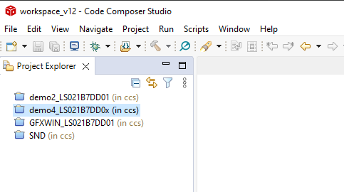

## Current consumption and its measurement

