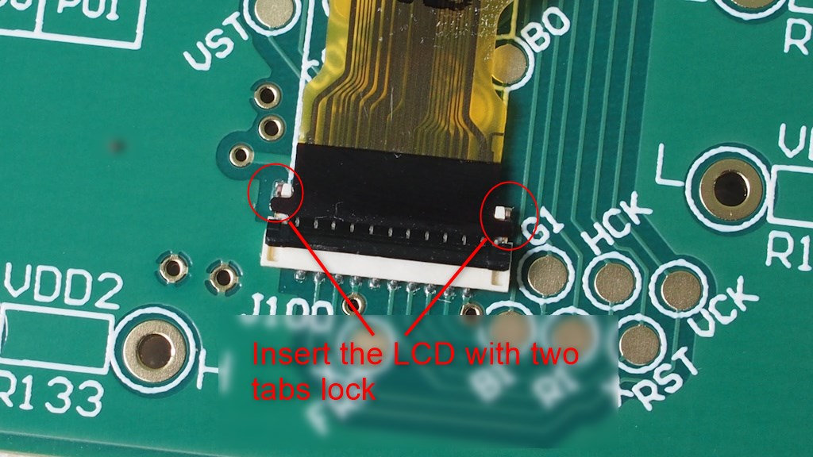
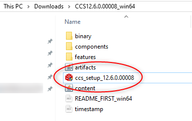
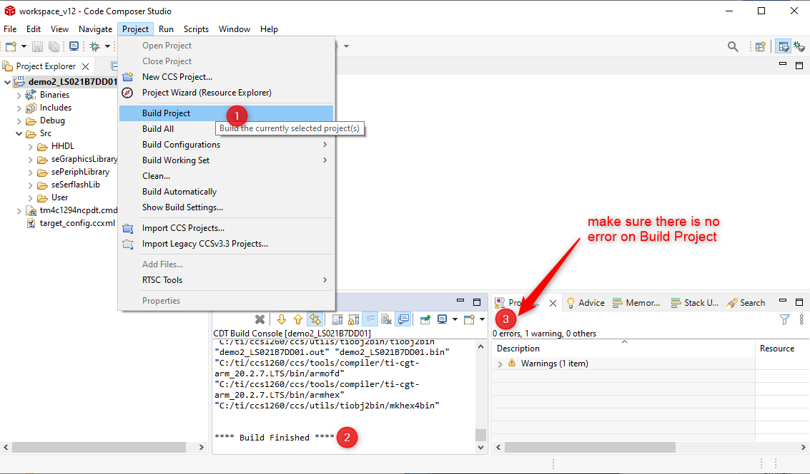
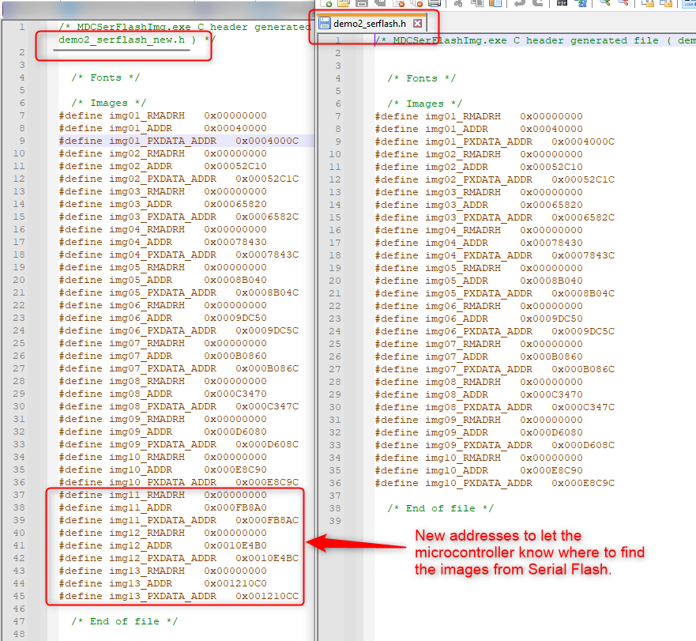
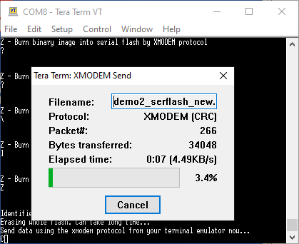
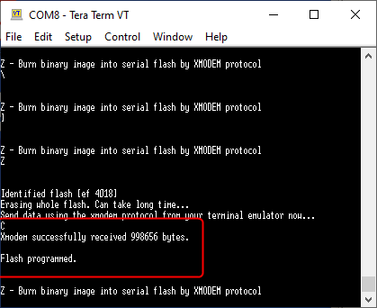

# LS021B7DD02 64-Color Memory LCD Evaluation Kit

1. [Introduction](#introduction)
2. [Board Overview](#board_overview)
3. [Setting Up the Hardware](#setting_up_hardware)
4. [Preparing Development Environment](#prepare_dev_env)
5. [Download S1D13C00 Software from Epson](#epson_sw)
6. [Importing the Examples](#import_examples)
7. [Prepare Binary Files for New Images](#new_images)
8. [Sending Binary Files to Serial Flash](#bin_files_update)
9. [Power Consumption and its Measurement ](#power_consumption)
10. [YouTube Video](#youtube)


 ## Introduction <a name="introduction"></a>

The LS021B7DD02 64-Color Memory LCD Evaluation Kit is a evaluation platform mainly for two components:

1. LCD model LS021B7DD02 manufactured by Sharp with the following specifications
   * Reflective active-matrix with slightly transmissive panel of Color
   
   * 2.13" screen of 240x320 resolution
   
   * 6-bit parallel data signal communication
   
   * 1 pixel has a RGB each of 2-bit color depth (64 colors)
   
     
   
2. S1D13C00 Memory Display Controller manufactured by Epson
   * a graphics controller for memory displays with internal, programmable step-up and charge-pump voltage converter which are typically needed by memory displays
   
   * 96Kbyte internal RAM for display frame buffer
   
   * hardware-based graphics engine for image copying, scaling, rotation, and shearing effects
   
   * support flexible MCU interface of 8-bit 8080 mode, SPI, and QSPI
   
     

## Board Overview <a name="board_overview"></a>


1. Molex connector 5035662102 to mate with LS021B7DD02
2. R132 (100R, 0.1%), R133 (100R, 0.1%), and R122(10R, 0.1%) with test points for VDD1 of LS021B7DD02, VDD2 of LS021B7DD02, and VDD of S1D13C00. Please read the schematic in this repository for details.
3. P102 is an interface connector of S1D13C00 to an external microcontroller
4. Backlight module
5. On/OFF switch of the backlight module
6. Buzzer connecting to P10 and P11 of S1D13C00 
7. A tact switch connecting to P07 of S1D13C00 
8. 2.54mm header connecting to P01 - P06 of S1D13C00 
9. P103, P104, P100, and P105 are pin header compatible with Arduino Uno form factor
10. Bridge board (EK-TM4C1294XL-Bridge) to interface with Texas Instruments Tiva:tm: C Series TM4C1294 LaunchPad Evaluation Kit
11. Jumper array to set 8080/HSPI/SPI as the microcontroller interface
12. P1 on EK-TM4C1294XL-Bridge to mate with P102 on LS021B7DD02 board
13. Texas Instruments Tiva:tm: C Series TM4C1294 LaunchPad Evaluation Kit

## Setting Up the Hardware <a name="setting_up_hardware"></a>

**Install the LCD**



**Mate the connectors**


**Make sure jumper positions are set to HSPI/SPI interface**


**Connect USB cable**


## Preparing Development Environment <a name="prepare_dev_env"></a>

Download and install Code Composer Studio (CCS) from TI's web site:

https://www.ti.com/tool/CCSTUDIO


*You will need to create a myTI account with a valid email and password to download the software.*

Various download options are supported: Windows/MacOS/Linux. In my case, I have selected the Windows single file (offline) installer:


Double click to run ccs_setup_xxxx.exe:




Accept the default installation directory for simplicity:


The Code Composer Studio supports all MCU and MPU models of Texas Instruments. We only need one of them. To save time and hard disk resources, select Custom Installation option followed by TM4C12x ARM Cortex-M4F core-based MCUs as the component to install.


Click a few more Next buttons to accept default installation options to continue. When you see the Installation Completed message, click OK to reboot your machine.


Next, download and install TivaWare which is a collection of royalty-free libraries to control the TM4C1294 MCU.

TivaWare is found at: http://www.ti.com/tool/SW-TM4C

Click **Download > Download options > SW-TM4C-2.2.0.295.exe**.


Accept the default installation directory.


Launch CCS with a workspace project created at your own convenience. In my case, the default workspace is located at **C:\Users\JohnLeung\workspace_v12**. Your case will be different in the field of user name. 


## Download S1D13C00 Software from Epson <a name="epson_sw"></a>

Software package containing the driver source code and demo projects of the S1D13C00 Memory Display Controller is available from Epson's web site at

https://vdc.epson.com/display-controllers/mdc/s1d13c00.

Scrolling down the page you will see a link to download an exe file [S1D13C00 Peripheral Circuit Sample Software Rev 3.0](https://vdc.epson.com/display-controllers/mdc/s1d13c00/s1d13c00-sample-software-for-ti-3).


Double click to install the software package.


Accept the default installation directory C:/EPSON.


Now you have everything to develop an application for LS021B7DD0x + S1D13C00 combo.


## Importing the Examples <a name="import_examples"></a>

Follow the procedures below to import and run the first project on LS021B7DD02 64-Color Memory LCD Evaluation Kit.

**Step 1:** Launch Code Composer Studio

**Step 2:** Import an example from the Epson folder you have just extracted in previous section. 

From **Project > Import CCS Projects**


**Step 3:** Browse to the location of S1D13C00 example folder at **C:\EPSON\S1D13C00_SW\Examples**,  select the **demo2_LS021B7DD01** folder, click **Select Folder** button


**Step 4:** You will see three options in the next screen. Select EK-TM4C1294XL as the host because it is what we are using. Click Finish.


**Step 5:** You will see a new project under the **Project Explorer**. Right click on the project title and select **Properties**.


**Step 6:** Expand Resource tab, click **Linked Resources**. Create a new Path Variable by clicking the **New** button.


**Step 7:** Enter TIVAWARE_INSTALL_DIR to the Name textbox. Click the **Folder...** button to add the path location of the TivaWare library > **Select Folder**. 


**Step 8:** You will see the New Variable dialog box look something like this. Click OK to exit. 


**Step 9:** Now there is a new Path Variable **TIVAWARE_INSTALL_DIR** that points to the path of the Tivaware library. Click **Apply and Close**.


**Step 10:** Build the project to make sure there is no error.



**Step 11:** For demo2, we need to make a minor modification to the source code. Expand **Src > User**, open main.c and browse to the bottom. Make change to the source code as follows:

```C
     if (pic != prevpic)
     {
         seQSPI_SetMasterRxMMA( img01_RMADRH, 0xEB );
         seDMAC_MemCpy32 (picslib[pic], RAM_BASE, 240*80, seDMAC_CH2);
         DISPLAYUPDATE();
         seMDC_WaitUpdDone();
         seQSPI_ClearMasterRxMMA();
         prevpic = pic;

         printf ("Current image number is %d\n", pic ); //this line is optional
        // This snippet doesn't work for some unknown reason(s)
        // Enable MMA mode
        // seQSPI_SetMasterRxMMA( img01_RMADRH, 0xEB );
        // FrameScrollUpdate (picslib[prevpic], picslib[pic], RAM_BASE, ...);
        // prevpic = pic;
        // seQSPI_ClearMasterRxMMA();
     }
```

The changes are summarised in the screen capture below:


**Step 12:** Click Debug button from the menu bar then Run.


**Step 13:** You may browse the photo catalogue by clicking on **SW1 on TM4C1294 LaunchPad**. 


Backlight is also available with an ON/OFF switch S100.


**Step 14:** Repeat the same procedures above to import more examples. Don't forget to set the Path Variable  of **TIVAWARE_INSTALL_DIR** as that in step 9 for other examples.


## Prepare Binary Files for New Images <a name="new_images"></a>

There are two methods to preload some images to the system:

1. in an external Serial Flash (Winbond 25Q128JVSQ 128Mbit Serial Flash onboard)

2. in Flash space of the host CPU in *.h format

Method 1 is preferred because it saves precious programming space of the CPU.

Images of demo2 are stored ex-factory in the 128Mbit (16MByte) Serial Flash W25Q128JVSIQTR.


Image sources are available from the `\source_images` folder.


Epson has released [three tools](https://vdc.epson.com/display-controllers/s1d13c00-peripheral-circuit-sample-software-manual/viewdocument/611) to convert fonts and images to formats compatible with S1D13C00.

Features of the tools are summarised as folllows:

| Tool                            | Features                                                     |      |
| ------------------------------- | ------------------------------------------------------------ | ---- |
| Font Conversion MDCFontConv.exe | Generate font bitmaps header (.h) or binary files (.mdcfont) from system fonts in PC. |      |
| MDCImgConv.exe                  | Convert common image formats (BMP, PNG, JPG, ICO, TIF, GIF) to pixel formats supported by S1D13C00. The tool can generate header files (.h), binary files (.mdcimg) or HEX files (.hex). |      |
| MDCSerFlashImg.exe              | Create a binary image for downloading to the serial flash W25Q128JVSIQTR |      |

Procedures described below demonstrate how to update the Serial Flash content with new images.

**Step 1:** Copy new images to `C:\EPSON\S1D13C00_SW\Examples\demo2_LS021B7DD01\source_images` for easier project management. You may find the new images from folder at [link](https://github.com/techtoys/Sharp-Color-Memory-LCD-EVK/tree/main/docs).


**Step 2:** Launch `MDCImgConv.exe` from `C:\EPSON\S1D13C00_SW\Tools`. Open each of the images (img11-13.png) from the path in step 1. Click the **Export image** button to convert to *.mdcimg format for each of the images.


**Step 3:** After conversions, you will get three new files in .mdcimg format. 


Launch `MDCSerFlashImg.exe` from `C:\EPSON\S1D13C00_SW\Tools`. Add all 13 images (img01.mdcimg - img13.mdcimg) to the dialog box. Don't forget to include the original files img01.mdcimg - img10.mdcimg unless you want to remove any one of them. In this example, we are adding three images to the list and keep the original 10 images.


Not to overwrite the original binary file, we may choose a new filename as `demo2_serflash_new`.

Click **Save**.


By inspecting the folder content, we will see that two files have been created: `demo2_serflash_new.bin` and `demo2_serflash_new.h`.

The binary file is the file to send to Serial Flash and the .h header file contains the address information.



Now, we are ready to send the new binary file to Serial Flash.

## Sending Binary Files to Serial Flash <a name="bin_files_update"></a>

Send a new binary file to the Serial Flash with [Tera Term](https://github.com/TeraTermProject/teraterm/releases). 

**Step 1:** Launch Tera Term, select the new COM Port enumerated by TM4C1294 LaunchPad. Click **OK**.


**Step 2:** From **Setup** > **Serial Port** > set **Speed to 115200** > click **New setting**.


**Step 3:** By clicking the reset button on TM4C1294-EK board, you will see a short manual on Tera Term. Type Z from the keyboard to erase the Serial Flash. 


**Step 4:** After erase complete you will see a prompting message to send data by XModem protocol. 


**Step 5:** From **File > Transfer > XMODEM > Send**, browse to the binary file `C:\EPSON\S1D13C00_SW\Examples\demo2_LS021B7DD01\source_images\demo2_serflash_new.bin` to download.


The progress of Xmodem transfer is shown. 



Wait until it finishes. Be patient, It takes time!



**Step 6:** When the message *"Flash programmed"* is shown, click reset on TM4C1294 LaunchPad.


You will see the first image on LCD on reset.


**Step 7:** There remains the final step to *let the microcontroller know* that, there are three new images in the Serial Flash. There are 4 places in the source code to change:

1. in `main.c`, change `#include "demo2_serflash.h`" > `#include "demo2_serflash_new.h"` to include the new address map,

2. modify `uint32_t picslib[10]` > `uint32_t picslib[13]` to include an array of 13 images,

3. modify the function `void Button1Handler(void)` from `++pic==10` to `++pic==13` to enable image scrolling up to index 12 with the push button SW1,

4. add the following code to include new image addresses.

   ```C
     picslib[10] = img11_PXDATA_ADDR;
     picslib[11] = img12_PXDATA_ADDR;
     picslib[12] = img13_PXDATA_ADDR;
   ```

   The screen capture of `main.c` is shown below for a better illustration.


Reprogram the board and click **reset**. Keep clicking **SW1** to browse to the new images.


## Power Consumption and its Measurement <a name="power_consumption"></a>

LS021B7DD02 is an ultra low power LCD that draws negligible current. There are two resistors of 100 Ohm +/-0.1% in the path of power supply with the schematics extracted below.


Test points are available for voltage drop measurements.


## YouTube Video <a name="youtube"></a>

<a href = "https://youtu.be/-nZKyYxobqU"></a>
